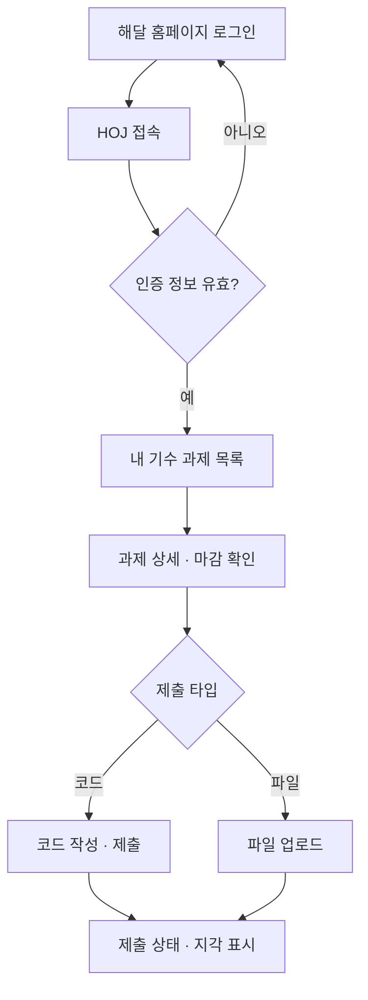
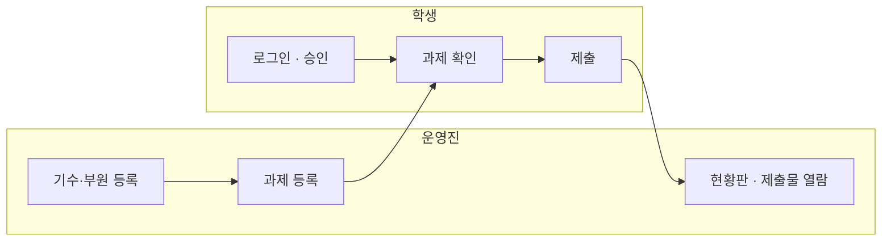

# HOJ MVP (P1) 스코프

> 이 문서는 P1의 범위와 완료 기준을 정의합니다. 스코프 논쟁이 생기면 이 문서로 돌아옵니다.
> 범위를 바꾸려면 `결정` 이슈를 먼저 엽니다.

## 1. 한 줄 정의

**운영진이 과제를 올리고, 학생이 제출하고, 운영진이 누가 냈는지 확인하는 최소 루프.**

이 루프가 한 바퀴 돌면 P1은 끝난 것이고, 루프에 필요 없는 기능은 P1이 아니다.

## 2. 해결하는 문제

부트캠프 운영에서 과제 수합과 현황 파악에 손이 많이 간다 (2026-08-02 회의).

- 과제 제출이 여러 채널(백준, 파일 전달 등)에 흩어져 있어 수합이 번거롭다.
- 누가 냈고 안 냈는지 파악하는 일이 수작업이다.
- 트랙마다 과제 형태가 달라(코드 / 웹 결과물 파일) 한 가지 방식으로 받을 수 없다.

## 3. 사용자와 여정

### 학생

로그인 → 내 기수 과제 확인 → 제출 → 상태 확인

### 운영진

기수·부원 등록 → 과제 출제 → 현황 파악 → 제출물 열람

### MVP 루프

## 4. 기능 목록

| 여정 | 기능 | 근거 |
|------|------|------|
| 학생 · 진입 | 로그인 (홈페이지 연동 유력, §7 참고) + 부원 확인 | 08-02: 홈페이지 정보 활용 |
| 학생 · 확인 | 내 기수 과제 목록·상세 (마감 표시) | 08-02: 자기 소속만 노출 |
| 학생 · 제출 | 코드 텍스트 / 파일 업로드 — 과제별 타입 지정 | 08-02: 코드 제출, 심화반은 파일 |
| 학생 · 사후 | 내 제출 상태 확인 (제출 완료 · 지각) | 마감 로직의 결과 표시 |
| 운영진 · 준비 | 기수 생성, 부원 등록 | |
| 운영진 · 출제 | 과제 등록·수정·삭제 (제출 타입 · 마감 설정) | |
| 운영진 · 파악 | 현황판: 과제별 제출 / 미제출 / 지각 명단 | 08-02: 관리자 대시보드 |
| 운영진 · 확인 | 제출물 열람 | |
| 공통 · 기반 | 역할(학생/운영진) 권한, 기수 기준 접근 제어 | 08-02 결정 |

## 5. 명시적 제외 목록

아래 기능은 P1에서 만들지 않는다. 추가하려면 `결정` 이슈를 먼저 연다.

| 제외 기능 | 이유 | 배치 |
|-----------|------|------|
| 자동 채점 (Judge0) | 백준이라는 대체 수단이 있어 학기 운영 가능. 인프라 작업이 커서 분리 | P2 |
| 온라인 저지 모드 (공개 문제 풀 · 리더보드) | 과제 관리가 본체. OJ는 그 위에 얹는 추가 기능 | P3 |
| 멘토 코멘트 · 점수 | 데이터 구조만 준비하고 기능은 제외 | P2 이후 |
| 알림 (디스코드 등) | P1은 미제출자 명단까지. 독촉은 사람이 한다 | P2 |
| 출석부 | 포함 여부 자체가 미결 (§7) | 결정 대기 |
| repo 링크 제출 | 코드 · 파일 두 타입으로 충분히 시작 가능 | 후순위 |
| 대회 기능 | 스코프 동결 | P3 이후 |

## 6. 완료 기준 (Definition of Done)

아래 항목이 전부 체크되면 P1 완료다. 하나라도 안 되면 완료가 아니다.

- [ ] 운영진이 기수를 만들고 부원을 등록할 수 있다
- [ ] 운영진이 제출 타입과 마감을 지정해 과제를 올릴 수 있다
- [ ] 학생이 로그인하면 자기 기수의 과제만 보인다
- [ ] 학생이 코드 과제에 코드를, 파일 과제에 파일을 제출할 수 있다
- [ ] 마감이 지난 제출은 지각으로 표시된다
- [ ] 학생이 자기 제출 상태를 확인할 수 있다
- [ ] 운영진이 과제별 제출 / 미제출 / 지각 명단을 볼 수 있다
- [ ] 운영진이 제출물을 열람할 수 있다
- [ ] 학생은 운영진 기능(등록·현황판)에 접근할 수 없다

## 7. 미확정 사항

| 항목 | 현재 상태 | 개발 가정 |
|------|-----------|-----------|
| 인증 방식 | 홈페이지 로그인 연동이 유력, 미확정. 폴백은 Google OAuth | 인증은 교체 가능한 부품으로 설계. 확정 전까지 스텁 인증으로 개발 진행 |
| 부트캠프 2학기 일정·규모 | 교육운영진 확인 중 | 확정 시 마일스톤 날짜 설정 |
| 출석부 | 포함 여부 미결 | 포함되더라도 "관리자 수동 체크 표" 수준까지만 |
| DB | PostgreSQL 권장, 미확정 | 개발은 로컬 PostgreSQL 기준 |

---

- 관련 문서: [회의록 2026-08-02](meetings/2026-08-02.md) · [의사결정 기록](decisions/)
- 이 문서가 P1 범위의 진실의 원천이다. CLAUDE.md의 로드맵은 이 문서를 참조한다.
